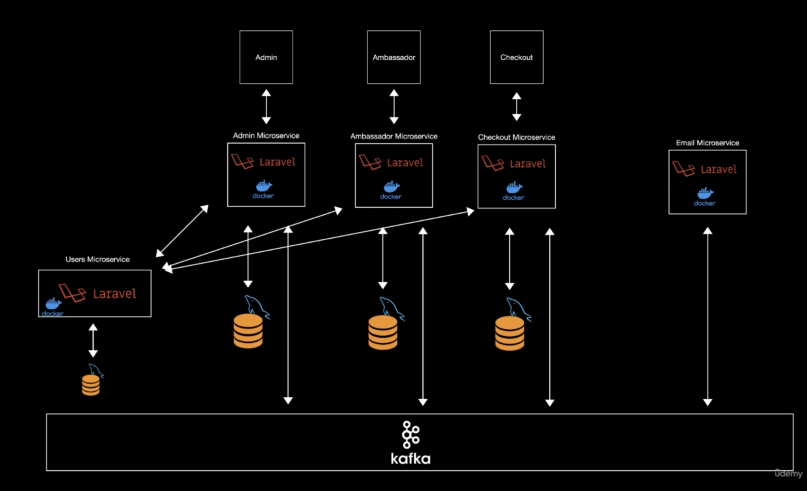

# Laravel Microservices: Breaking a Monolith to Microservices

## About
This is the source code after "Breaking a Monolith to Microservices."

The source code consists of 2 parts:
* Backend written in Laravel:
    * Admin service: Manages adding and editing products.
    * Ambassador service: Manages ambassador-related components.
    * Checkout service: Handles payments using Stripe.
    * Email service: Responsible for sending emails.
    * User service: Manages users.
* Frontend written in Vue-Nuxt:
    * Nuxt-checkout: Layout for the checkout section.
    * Vue-admin: Layout for the admin section.
    * Vue-ambassador: Layout for the ambassador section.

### Flow Diagram


## Usage
1. Run kafka

        cd microservices/kafka
        docker-compose up

2. Run users

        cd microservices/users
        docker-compose up

3. Run admin

        cd microservices/admin
        docker-compose up

4. Run ambassador

        cd microservices/ambassador
        docker-compose up

5. Run checkout

        cd microservices/checkout
        docker-compose up

6. Run email

        cd microservices/email
        docker-compose up

7. Run nuxt-checkout

        cd vue-ambassador/nuxt-checkout
        yarn dev

8. Run vue-admin

        cd vue-ambassador/vue-admin
        yarn serve

9. Run vue-ambassador

        cd vue-ambassador/vue-ambassador
        yarn serve


## Lessons learned
### Kafka
- Sử dụng kafka để gửi nhận message queue
- Tạo docker file cho kafka. Tham khảo file docker-compose.yaml trong thư mục microservices/kafka
  - zookeper: quản lý và giám sát các dịch vụ phân tán
  - kafka: nền tảng stream dữ liệu phân tán
  - kafdrop: UI để quản lí kafka
- Cài đặt extension kafka cho php. Tham khảo Dockerfile trong thư mục microservices
- Sử dụng kafka dưới dạng laravel queue
- Reuse cấu hình kafka thành package riêng

Link tham khảo: https://viblo.asia/p/003-gui-va-nhan-message-trong-apache-kafka-LzD5dMmzKjY

### Users service
- Tương tác với các services khác bằng private api
- Check scope bằng function và middleware
  - microservices/admin/app/Http/Middleware/ScopeAdminMiddleware.php
  - microservices/ambassador/app/Http/Middleware/ScopeAmbassadorMiddleware.php
- Reuse xử lí gọi tới Users service thành package riêng

### Mailhog
- MailHog là một công cụ để test việc gửi mail cho môi trường localhost

### Docker
- Các container muốn kết nối được thì phải join vào các mạng với nhau
- Phải tạo network trước hoặc tạo network lúc docker-compose up
- Nếu create network bằng docker compose thì file docker-compose.yaml chính thì tạo network như bình thường,
còn các file docker-compose.yaml tham gia mạng thì cần phản thêm tham số `external: true`
- Để từ docker truy cập ra host bên ngoài thì dùng `host.docker.internal`

### Laravel
- Create custom queue

### Mysql
- Cách sync 1 old db to new db

Tham khảo các file sau:
* microservices/admin/config/database.php
```php
'old_mysql' => [
    'driver' => 'mysql',
    'url' => env('DATABASE_URL'),
    'host' => env('DB_HOST2', '127.0.0.1'),
    'port' => env('DB_PORT2', '3306'),
    'database' => env('DB_DATABASE2', 'forge'),
    'username' => env('DB_USERNAME2', 'forge'),
    'password' => env('DB_PASSWORD2', ''),
    'unix_socket' => env('DB_SOCKET', ''),
    'charset' => 'utf8mb4',
    'collation' => 'utf8mb4_unicode_ci',
    'prefix' => '',
    'prefix_indexes' => true,
    'strict' => true,
    'engine' => null,
    'options' => extension_loaded('pdo_mysql') ? array_filter([
    PDO::MYSQL_ATTR_SSL_CA => env('MYSQL_ATTR_SSL_CA'),
    ]) : [],
]
```
* microservices/admin/database/seeders/LinkSeeder.php
```php
public function run()
{
    $links = DB::connection('old_mysql')
        ->table('links')->get();

    foreach ($links as $link) {
        Link::create([
            'id' => $link->id,
            'user_id' => $link->user_id,
            'code' => $link->code,
            'created_at' => $link->created_at,
            'updated_at' => $link->updated_at,
        ]);
    }
}
```

## Resources

### Link Udemy
- [https://www.udemy.com/course/laravel-microservices](https://www.udemy.com/course/laravel-microservices)

### Source code monolith
- [https://github.com/antoniopapa/laravel-ambassador](https://github.com/antoniopapa/laravel-ambassador)
- [https://github.com/antoniopapa/vue-ambassador](https://github.com/antoniopapa/vue-ambassador)

### Kafka Queue Package
- [https://github.com/shishima123/kafka-queue](https://github.com/shishima123/kafka-queue)

### User Service Package
- [https://github.com/shishima123/user-service](https://github.com/shishima123/user-service)